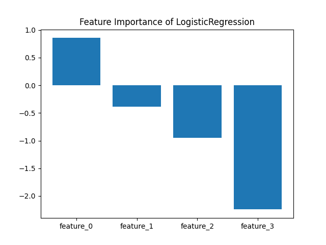

# The LogisticRegression Card

##### This model card was generated automatically using the Cardz library.

## Intended Use

This experiment was conducted to test the performance of the classification ML model: LogisticRegression on our dataset.

## Model Overview

LogisticRegression is a classification model. It is used to predict a binary outcome (0 or 1, yes or no, true or false) by estimating probabilities using a logistic function. Logistic regression is used in a variety of scenarios such as predicting whether a customer will default on a loan, or predicting whether a patient has a certain disease.

## Model Details

The model was created using Scikit-Learn's LogisticRegression algorithm with the following hyperparameters:

| Hyperparameter | value | Default |
|:--------------:|:-----:|:-------:|
| **C**| 1.0 | 1.0 | 
| **class_weight**| None | None | 
| **dual**| False | False | 
| **fit_intercept**| True | True | 
| **intercept_scaling**| 1 | 1 | 
| **l1_ratio**| None | None | 
| **max_iter**| 200 | 100 | 
| **multi_class**| auto | auto | 
| **n_jobs**| None | None | 
| **penalty**| l2 | l2 | 
| **random_state**| None | None | 
| **solver**| lbfgs | lbfgs | 
| **tol**| 0.0001 | 0.0001 | 
| **verbose**| 0 | 0 | 
| **warm_start**| False | False | 

A short description of the hyperparameters of the LogisticRegression model:

- C: inverse of regularization strength;

- Class_weight: set the parameters for different classes for unbalanced datasets;

- Dual: dual or primal formulation;

- Fit_intercept: whether to calculate the intercept;

- Intercept_scaling: scaling of the intercept;

- L1_ratio: the Elastic Net mixing parameter, with 0<=l1_ratio<=1;

- Max_iter: maximum number of iterations;

- Multi_class: ovr, multinomial or binary;

- N_jobs: number of jobs to use for computation;

- Penalty: norm used in the penalization;

- Random_state: seed of the pseudorandom number generator;

- Solver: Algorithms to use in the optimization problem;

- Tol: tolerance for stopping criteria;

- Verbose: level of verbosity of the solver;

- Warm_start: When set to True, reuse the solution of the previous call to fit as initialization.

### Feature Importances

The following table shows the feature importances for the model:

| Feature | Importance |
|:-------:|:----------:| 
 | feature_0 | 0.8558838247165591 |
 | feature_1 | -0.3899730295470144 |
 | feature_2 | -0.9526578100271536 |
 | feature_3 | -2.2440109771263574 |

The following Bar Plot shows the feature importances for the model:

